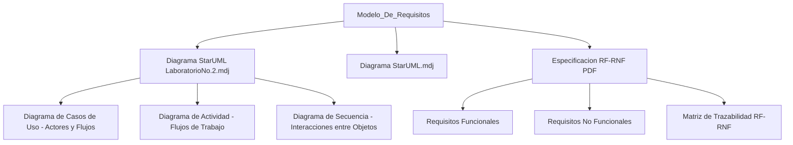

# Ingeniería de Software — Modelo de Requisitos

> Especificación y modelado completo de requisitos de software con UML en StarUML.

## Descripción

---

Proyecto de **Ingeniería de Software** enfocado en la elicitación, análisis y modelado de requisitos: definición de requisitos funcionales y no funcionales, construcción de casos de uso con StarUML (diagrama de casos de uso, actividad y secuencia) y análisis de viabilidad del sistema.

## Artefactos producidos

| Artefacto | Herramienta |
|---|---|
| Diagrama de casos de uso | StarUML (.mdj) |
| Diagrama de actividad | StarUML (.mdj) |
| Especificación de RF/RNF | Documento estructurado |
| Matriz de trazabilidad | Excel |

## Arquitectura

## Contenido del repositorio

| Archivo | Descripción |
|---|---|
| `Diagrama StarUML LaboratorioNo.2.mdj` | Diagrama de casos de uso Lab. 2 |
| `Diagrama StarUML.mdj` | Diagrama complementario |
| `*.pdf` | Especificación completa de requisitos |

## Contexto académico

**Asignatura:** Ingeniería de Software · **Institución:** Ingeniería Informática
**Autor:** Alejandro De Mendoza — Ingeniero Informático · Especialista Ingeniería de Software

---

## Autor

**Alejandro De Mendoza**  
Ingeniero Informático · Especialista en IA · Especialista en Ingeniería de Software · Máster en Arquitectura de Software

